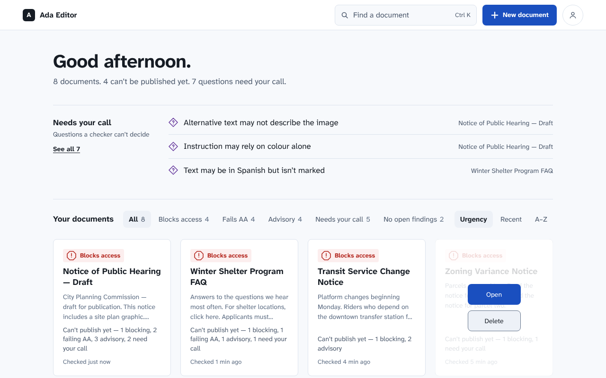
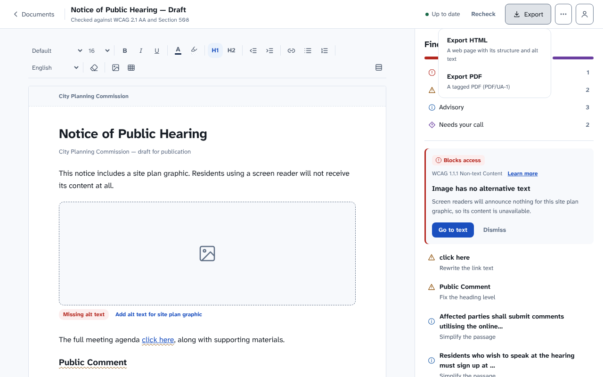
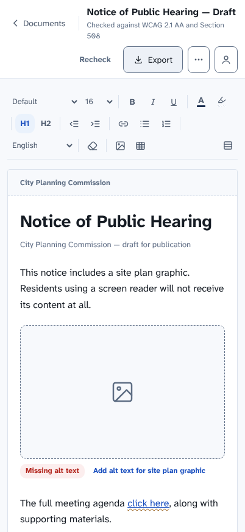

# Ada-editor

**A browser-based document editor that checks your writing against WCAG 2.1 AA
and Section 508 as you type — and never tells you a document is "compliant".**

**Live demo:** <https://ada-editor-umber.vercel.app>

**Stack:** Next.js 15 · React 19 · TypeScript · ProseMirror · Tailwind CSS 4 ·
Supabase (Auth, Postgres + row-level security, Storage) · pdfkit · veraPDF and
axe-core in CI

- **Checks as you write.** Nineteen WCAG rules run in the browser against the
  live ProseMirror document, and every finding cites the success criterion it
  comes from.
- **Imports Word files without uploading them.** `.docx` tables (header rows,
  merged cells) and image alt text come across; anything the editor can't hold
  is listed on the document instead of dropped.
- **Exports accessible HTML and tagged PDF (PDF/UA-1).** CI validates the PDF
  exporter with veraPDF.
- **Works with or without an account.** Local mode keeps documents in the
  browser; signed-in documents sync through Supabase with revision checks, so
  edits from two devices are never silently overwritten.
- **Honest about its limits.** Findings that need a human get their own
  severity ("Needs your call"), because automated checking covers roughly a
  third of WCAG.

---

Write documents that meet WCAG 2.1 AA and Section 508.

A writing tool that checks documents for accessibility problems as you write —
and is honest about the limits of what a checker can know.

**Conformance targets.** The ADA specifies no document technical standard, so
"ADA compliant" is a marketing claim rather than something a tool can check
against. Ada-editor checks against the standards that regulators and procurement
actually cite:

| Standard | Applies to | Why it is here |
|---|---|---|
| **WCAG 2.1 AA** | Web and digital documents | The DOJ Title II rule (April 2024) adopts it; the de facto global baseline |
| **Section 508** | US federal procurement | Incorporates WCAG 2.0 AA by reference; required to sell to federal agencies |
| **PDF/UA** (ISO 14289) | Tagged PDF output | The only standard that covers PDF structure. **Export PDF** writes PDF/UA-1, and CI validates it with veraPDF: clean sample documents pass, flagged ones fail on exactly the clauses their findings name. Documents don't list it as a target, because what is validated is the exporter, not each document |

Every finding cites the specific success criterion it comes from. Nothing in the
product reports "ADA compliance" as a status.

## Screenshots

Captured from a local production build in local mode (no account), using the
sample documents the app seeds on first visit.

**The desk** — every document, ranked by what stops it being published.



**The editor** — findings sit beside the document, each citing its WCAG
criterion, with "Go to text" as the primary action.


<table>
<tr>
<td width="62%"></td>
<td></td>
</tr>
<tr>
<td><b>Export</b> — HTML or tagged PDF (PDF/UA-1)</td>
<td><b>Phone width</b></td>
</tr>
</table>

## Current state

Working prototype. The homepage and editor screens are built from the design
system, and every finding is computed by
the **real checking engine**: nineteen WCAG rules running against the live
ProseMirror document — structural rules as you type, prose heuristics on
blur/Recheck. **Export HTML** downloads the document as a standalone page
(the document's language, landmarks, headings and links intact, and its images
embedded in the page with their alt text; whatever the checker flags is still
wrong in the export, so an image without alt text is exported without it).
**Insert image** takes a PNG, JPEG, GIF or WebP file (up to 10 MB), checked by
its contents, not its name. **Upload .docx**
imports an existing Word file in the browser (the file itself is never
uploaded) and checks it like any other document. Tables come across as real
tables, header rows and merged cells included, and a table with no header
cells is a blocking finding. Pictures come across with their alt text, and
the first picture in the header and footer becomes that band's image. What
the editor can't hold yet (footnotes, decorative images, tables nested inside
table cells, pictures in formats a browser can't draw such as EMF/WMF, or
linked from outside the file) is listed on the document instead of dropped
silently. **Export PDF** builds a tagged PDF (PDF/UA-1) in the browser,
with the same promise as the HTML export: headings, lists, links, language
changes, alt text and tables (header cells with their scope, merged cells with
their spans) are tagged from the document's own structure, and a figure
the checker flags as missing alt text is exported without it. A table's header
rows repeat on each page it runs onto; a single table row taller than a page is
stacked cell by cell instead of drawn as a grid. CI runs
[veraPDF](https://verapdf.org) on exports of the sample documents: clean ones
pass PDF/UA-1, and a flagged one fails on exactly the clauses its findings name.
The PDF embeds one font, Atkinson Hyperlegible Next, which covers Latin scripts
only; a document with Greek, Cyrillic, Hebrew, Arabic or CJK text is refused
with the characters listed, never drawn as empty boxes. There is no PDF upload
yet.

**Accounts and storage.** People sign in with an emailed one-time code
(Supabase Auth), and documents are saved to their account in Supabase
(`supabase/migrations/`; row-level security keeps each account's documents to
itself — `supabase/tests/rls.sql` checks it). The hosted project's migration
history uses the files' own versions: a migration applied another way (the
Supabase MCP, the SQL editor) is recorded under the time it ran, so set its
row in `supabase_migrations.schema_migrations` to the file's version
afterwards (or `supabase migration repair`), or the CLI will try to run it
again. Sign-in and creating an account are separate doors (`/sign-in`, `/sign-up`)
on the same emailed code: sign-in never creates an account. The emails are
`supabase/templates/sign-in-code.html`, pasted into Supabase's **Magic link**
template (subject: *Your Ada Editor sign-in code*), and
`supabase/templates/welcome-code.html`, pasted into **Confirm signup**
(subject: *Welcome to Ada Editor*); Supabase fills in `{{ .Token }}` and
`{{ .Email }}`. The browser keeps a working copy,
so typing never waits on the network and edits made offline sync when the
connection returns. Each document carries a server-stamped revision: a save
only lands while the server still has the revision it was edited from, so
edits made on two devices are never silently overwritten; the person is asked
to keep theirs, mine or both (`app/_data/sync.ts`, `app/_auth/ConflictDialog.tsx`).
Coming back to a tab fetches what changed elsewhere. Images live outside the document: a figure stores the
SHA-256 of its bytes, and the bytes go to the account's private `images`
bucket at `<user id>/<key>` (storage policies limit each account to its own
folder; `supabase/migrations/20260930120000_images.sql`), cached in the
browser's IndexedDB. A picture larger than 2400 px on its longer side is
shrunk to that as it's added, dropped, pasted or imported
(`app/_editor/prepareImage.ts`). Deleting a document removes the images no other document
uses; an image edited out of every document stays (undo can bring it back)
until a once-a-day sweep after sign-in removes it, a week or more after its
upload (`sweepImages` in `app/_data/sync.ts`). Local mode keeps them in IndexedDB only. Without `NEXT_PUBLIC_SUPABASE_URL` and a publishable key
set — CI, or a plain `npm run dev` — the app runs in **local mode**: no sign-in,
documents in this browser's localStorage only, exactly as before accounts.

- **[Grammarly UX/UI audit](docs/audit/grammarly-ux-audit.md)** — what we took,
  adapted and refused
- **[Design system](docs/design-system/README.md)** — principles, tokens,
  patterns, conformance bar
- **[Rule-set spike](docs/audit/rule-set-spike.md)** — validated the checking
  engine's rule set against 28 real documents before building it
- **[Checking engine implementation plan](docs/audit/checking-engine-plan.md)**
  — architecture, rule porting, persistence and performance behind the engine
  that replaced the editor's fixture findings

## Quick start

```bash
npm install
npm run verify     # typecheck, verifier tests, engine gate, PDF gate, token gate, accessibility gates (Node 22)
npm run preview    # serve the live preview at http://127.0.0.1:8080
```

`npm run e2e` (needs Docker) runs the account path end to end against a **local**
Supabase stack (`supabase/config.toml`, started and stopped for you): sign-in by
emailed code read from the stack's mail catcher, sync, offline and back, sign-out
from another tab, a signed-in PDF export through veraPDF, the message form,
account deletion, and `supabase/tests/rls.sql`. It never touches the hosted
project. CI runs it on every PR.

`node scripts/verify-tokens.mjs --verbose` and `node scripts/palette-ceiling.mjs`
run with no dependencies at all. The PDF gate's conformance half needs Java 11+
and Maven (it fetches veraPDF from Maven Central on first run); without them it
checks the PDF's structure only and says so. `npm run pdf -- --out pdfs` keeps
the exported PDFs for a look in a real reader.

## Is the form right?

Tested, not assumed. [The rule-set spike](docs/audit/rule-set-spike.md) ran 13
WCAG rules over 28 real documents against criteria registered before the run.
Three of four assumptions held: findings are mostly machine-decidable (18%
manual), anchor to text ranges (95%), and are plentiful (median 12 per
document). One failed: **only 4.8% carry an automatic fix**, which moved the
card's primary action from "Apply fix" to "Go to text".

## Three decisions worth knowing up front

1. **Colour never carries meaning alone.** Severity is encoded in underline
   shape, glyph and visible text. Measured with CIEDE2000, most severity pairs
   survive colour-vision deficiency — but red/amber (`blocker` vs `violation`,
   the most consequential distinction) collapses to dE 4.1, right on the axis
   red-green deficiency removes. A CVD-safe palette is achievable; it costs the
   conventional red/amber ramp, so we keep the ramp and carry meaning in shape,
   glyph and text instead. Re-test with `node scripts/palette-ceiling.mjs`.
2. **The findings list is the interface**, not the inline underline. No ARIA
   mechanism reliably exposes an arbitrary inline annotation, so anything only
   reachable through the prose is unreachable for some users.
3. **Nothing ever claims the document is compliant.** Automated checking covers
   roughly a third of WCAG. Findings that need human judgement get their own
   severity — `manual` — and the empty state says so.

> **On the name:** "Ada" here is the Americans with Disabilities Act, not the
> programming language. The Act is what motivates the product; the standards in
> the table above are what it actually checks.
