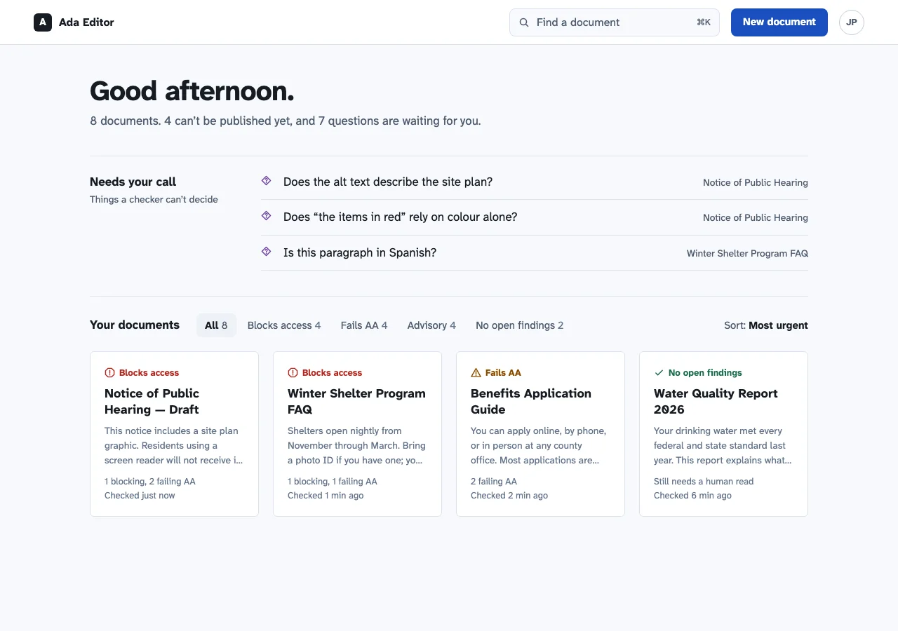
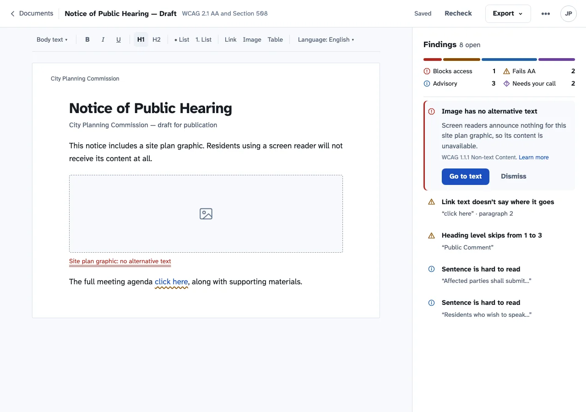
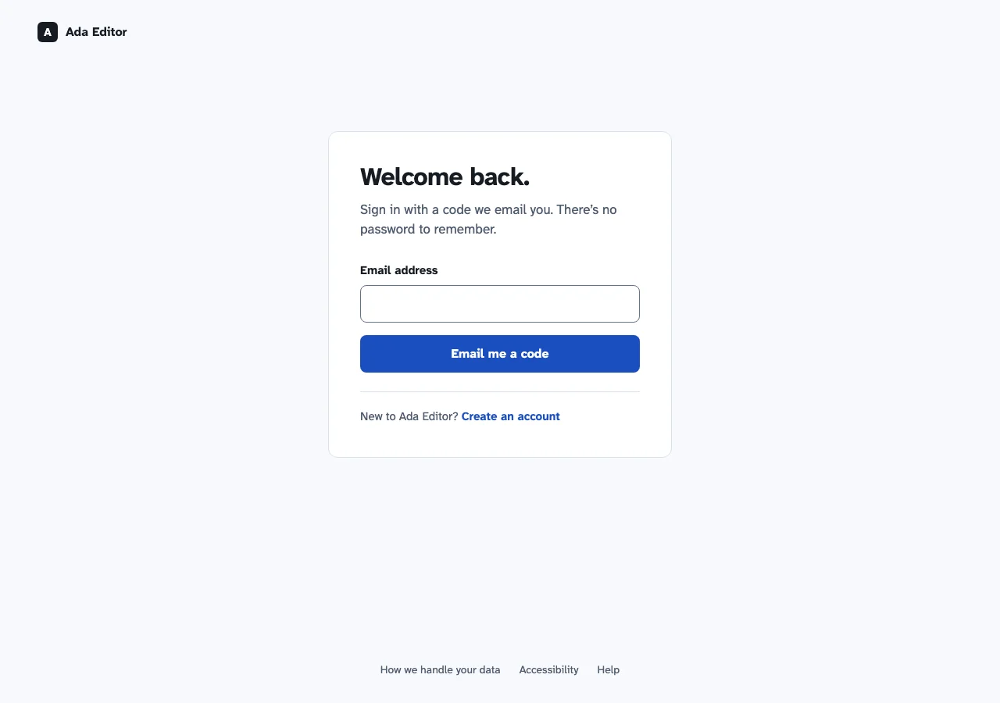

# UX/UI audit, October 2026

**What I looked at:**
- Every screen in light and dark, at 1280px and 375px, captured from local mode with the eight fixture documents.
- 39 screenshots, plus 6 mockups of the proposed direction, all in [`ui-audit-2026-10/`](ui-audit-2026-10/).
- Branch: `remove-samples` (landing-v5 plus the empty-desk change).

**The goal:** a calm, editorial app that looks modern and well made, without giving up any of the [principles](../design-system/principles.md):
- Colour is never the only channel.
- The findings list is the product.
- Never claim compliance.
- Constraints are enforced by code.
- The document is the interface.

> The Next.js "N" badge in the corner of the screenshots is the dev server's overlay, not the app.

## The one-line verdict

Ada Editor looks like **three products**:
- **The public pages:** tight grotesk headlines, gradient washes, mono labels.
- **The desk:** a Georgia serif greeting, tilted paper and lilac sticky notes.
- **The editor:** a royal-blue "A11y Studio" bar, a system font, and its own 38-colour Atlassian palette that ignores dark mode.

Each is reasonable alone; together they read as unfinished. The fix is mostly **subtraction**:
- one typeface
- one palette, the existing tokens
- straight lines
- fewer boxes

## Findings, ranked

Tags:
- `remove`: clutter to delete. These rank first, because calm comes from subtracting.
- `consistency`, `hierarchy`, `type`, `spacing`, `colour`, `component`, `state`.

Effort: S = under a day, M = a day or two, L = several days.

| # | Screen | Tag | Problem → fix | Effort | Evidence |
|---|---|---|---|---|---|
| 1 | Editor | `remove` | A royal-blue bar with the old name **"A11y Studio"** and a hard-coded **"JD"** avatar is the loudest thing on screen, and it belongs to someone else. → One 60px bar in the canvas colour: back to Documents, title, save status, Export, account menu. | S | [editor light](ui-audit-2026-10/editor--desktop-light.webp) |
| 2 | Desk | `remove` | Every sheet, note and the empty-desk panel sits on paper rotated by up to 3° (`DESK`, `GRID_TILT`, `NOTE_TILT` in `Home.tsx`), and hovering straightens it. The text stays upright, but the ragged edges and hover motion are most of why the desk feels busy. → A straight, aligned grid. | S | [desk grid](ui-audit-2026-10/desk-grid--desktop-light.webp) |
| 3 | Desk | `remove` | Tracked all-caps eyebrows everywhere: "ADA EDITOR", "WAITING ON YOUR CALL", "YOUR DOCUMENTS", and "YOUR CALL" repeated on every note. → Sentence-case section headings; drop the per-note label, since the section already says it. | S | [desk loose](ui-audit-2026-10/desk-loose--desktop-light.webp) |
| 4 | Desk | `remove` | Each sheet opens with grey placeholder lines that look like loading skeletons. → The document's first lines, in tertiary text: real information instead of decoration. | S | [desk grid](ui-audit-2026-10/desk-grid--desktop-light.webp) |
| 5 | Desk | `remove` | The header, greeting and sections rise in with a staggered 600ms animation on **every visit** (`home-rise`). Principle 5: nothing animates unless it is communicating a state change. → Delete it; keep motion for opening, closing and confirming. | S | `app/_home/home.css:69,85,202,354` |
| 6 | Editor | `remove` | Boxes inside boxes: the toolbar is a floating card with a shadow, the findings summary is a card, and the active finding is a card inside the panel. → One panel with hairline dividers. The active finding becomes a tinted row with a left rule in its severity colour. | M | [editor card](ui-audit-2026-10/editor-card--desktop-light.webp) |
| 7 | Editor | `remove` | Five header controls at equal weight: Language, Export HTML, Export PDF, Recheck, Delete document. Delete sits one button away from Export. → **Export ▾** (HTML, PDF), Recheck as a quiet text button, and Delete and Language under **More**. | M | [editor light](ui-audit-2026-10/editor--desktop-light.webp) |
| 8 | Public pages | `remove` | Gradient washes in the hero and the closing band, mono uppercase labels, and a giant "Ada" watermark in the footer. These are the template tells that make it look generic, not calm. → One quiet canvas and sentence-case labels; keep the layout landing-v5 just shipped. | M | [welcome](ui-audit-2026-10/welcome--desktop-light.webp) |
| 9 | All | `consistency` | **Three visual languages** (see the verdict above). → One family and one palette: the editor moves onto the Ada tokens (delete `.palette`'s 38 literal colours), and every screen uses one typeface (direction below). | L | `app/_editor/editor.module.css:15-62` |
| 10 | Editor, sign-in, 404 | `consistency` | The browser's default 8px page margin shows as a frame round the editor, black in dark mode. Only `home.css` and `site.css` reset it, so every other screen inherits the bug. → One `body { margin: 0 }` in the shared base (`design-system/primitives.css`). Fixed once, at the root. | S | [editor dark](ui-audit-2026-10/editor--desktop-dark.webp) |
| 11 | Editor | `colour` | The editor ignores dark mode: a dark desk opens into a fully light editor. → It follows the tokens (from #9); the document page itself stays white paper, as decided. | M | [editor dark](ui-audit-2026-10/editor--desktop-dark.webp) |
| 12 | Editor (phone) | `hierarchy` | At 375px the document starts about 450px down, under three rows of header buttons and a four-row toolbar. → The header collapses to Export and More, and the toolbar becomes one row that scrolls sideways. | M | [editor phone](ui-audit-2026-10/editor--phone-light.webp) |
| 13 | Sign-in | `hierarchy` | A bare form at the top of a blank white page: no brand, no way back to the site, no help. → Brand mark linking home, the form on a raised sheet, and footer links (privacy, accessibility, help). PR 3 builds this, with create-account as its own door. | S | [sign-in](ui-audit-2026-10/sign-in--desktop-light.webp) |
| 14 | 404 / status | `state` | Bare centred text at the top of an empty page. → Same shell as sign-in: brand, message, one clear action. | S | [404 dark](ui-audit-2026-10/not-found--desktop-dark.webp) |
| 15 | Empty desk | `spacing` | With the sample gone, the how-it-works panel sits left, with half the screen empty beside it. → Centre it in the reading column. | S | [empty desk](ui-audit-2026-10/desk-empty--desktop-light.webp) |
| 16 | Desk (phone) | `component` | Two sheets per row at 375px: badges break ("Blocks / access") and titles wrap to four lines. → One column under 480px. | S | [desk phone](ui-audit-2026-10/desk-grid--phone-light.webp) |
| 17 | Desk | `hierarchy` | Six pill filters, then a second row of sort tabs, then a rule: two control rows before any document. → One row: quiet text tabs with counts, and the sort at the end. | S | [desk grid](ui-audit-2026-10/desk-grid--desktop-light.webp) |
| 18 | Desk | `type` | "Your desk 8 documents" is a second large serif headline competing with the greeting. → The greeting carries a factual summary ("8 documents. 4 can't be published yet."), and sections get small bold headings. | S | [desk grid](ui-audit-2026-10/desk-grid--desktop-light.webp) |
| 19 | Desk | `component` | "New document" is an icon-only blue "+", and the account is a bare outline icon. → A text button, "New document", and an account button showing the person's initials. | S | [new menu](ui-audit-2026-10/desk-new-menu--desktop-light.webp) |
| 20 | Editor | `type` | Severity chips in tracked capitals ("BLOCKS ACCESS", "MISSING ALT TEXT") and truncated actions ("Simplify t…"). → Sentence case with glyph and text, matching the desk. Finding rows put the title on one line and the location on the next; nothing truncates. | S | [editor light](ui-audit-2026-10/editor--desktop-light.webp) |
| 21 | Editor | `type` | Meta strings joined with middle dots ("1 blocking · 2 failing AA · 3 advisory · 2 need your review"), duplicating the counts listed right above them. → Delete the line; the counts already say it. | S | [editor light](ui-audit-2026-10/editor--desktop-light.webp) |
| 22 | All | `colour` | Tertiary text (`#64748B`) measures **4.20:1** on the secondary-button tint (`#EDF1F7`), which fails AA. It's only **4.51:1** on the sunken background (`#F7F9FC`), one rounding from failing. Neither pair is asserted, so the gate can't catch a regression. → Assert both in `tokens.json` (principle 4) and use secondary text on tints. | S | `node scripts/verify-tokens.mjs --pair` |
| 23 | Welcome (dark) | `state` | In dark mode the hero keeps its pastel gradient while the product shot below turns dark, leaving a hard diagonal seam. → Resolved by #8 (no gradient); otherwise the hero follows the theme. | S | [welcome dark](ui-audit-2026-10/welcome--desktop-dark.webp) |

**Left alone on purpose:**
- **Severity colours, glyphs and underline shapes.** These are principle 1, and the tokens gate them.
- **Findings as a list beside the page.** Principle 2.
- **The "Needs your call" severity, and "No open findings — still needs a human read".** Principle 3.
- **Focus rings, target sizes and the 66ch measure.** These are the conformance bar, not style.
- **The search dialog.** It's already the best component in the app: clear keyboard legend, real status badges. Its only issue is #3's capitals.

## The direction

**Subject:** a writing tool for people who publish public information (clerks, agencies, nonprofits). Its job is to get a document from draft to something everyone can read.

The one memorable choice is the **typeface**. Everything else stays quiet.

### Type: Atkinson Hyperlegible Next, everywhere

- **Why it fits:** it was designed by the Braille Institute for low-vision readers. A legibility tool set in the legibility typeface is an argument, not decoration.
- **Already shipped:** it's in `public/fonts/` because the PDF export embeds it. Using it on screen means the document you write looks like the PDF you export.
- **No new dependency:** it's already a project asset.
- **It replaces three families:** the system UI stack, Georgia (desk) and the editor's Atlassian stack.

**Scale.** Two weights only, 400 and 700, the four files we ship. The rem values below are those at the Default text size; they scale with PR 4's text size setting.

| Role | Size / line height | Weight | Tracking |
|---|---|---|---|
| Display (greeting, sign-in heading) | 2.5rem / 1.1 | 700 | −0.02em |
| Document h1 | 2rem / 1.2 | 700 | −0.015em |
| Section heading | 1.0625rem / 1.4 | 700 | 0 |
| Body and document text | 1.0625rem / 1.65 | 400 | 0 |
| UI text | 0.9375rem / 1.5 | 400 / 700 | 0 |
| Small (meta, timestamps) | 0.8125rem / 1.5 | 400 | 0 |

**No all-caps labels anywhere.**

**Token change:**
- `--ada-type-family-ui` and `--ada-type-family-doc` both become `'Atkinson Hyperlegible Next', system-ui, sans-serif`.
- A shared `@font-face` with `font-display: swap`, served from `/fonts/`.

### Colour: the palette we already have, used more quietly

There are no new colours. Every value below is an existing token whose contrast `verify-tokens` already asserts:

| Name | Token (light / dark) | Use |
|---|---|---|
| Desk | `surface-sunken` `#F7F9FC` / `#080B0F` | Page background behind everything |
| Paper | `surface-raised` `#FFFFFF` / `#161C24` | Sheets, panels, the sign-in sheet. The editor's document page stays `#FFFFFF` in both themes. |
| Ink | `text-primary` `#161C24` / `#EDF1F7` | Text (17.13:1 / 16.96:1) |
| Graphite | `text-secondary` `#4E5B6E` / `#C2CCDA` | Supporting text (6.90:1 / 11.85:1) |
| Rule | `border-subtle` `#DCE3ED` | Hairlines; replaces shadows and nested cards |
| Civic blue | `action-primary-bg` `#1A4FBF` / `#A8C7FA` | One primary action per view (7.21:1 / 11.18:1 with its text) |

**What changes is restraint:**
- Tinted fills are kept for status: severity badges, and the active finding's row.
- Decorative fills go: lilac sticky notes, gradient washes, the blue bar.

**Measured for this direction** with `node scripts/verify-tokens.mjs --pair`:

| Pair | Ratio | Result |
|---|---|---|
| Secondary on desk, light (`#4E5B6E` on `#F7F9FC`) | 6.54:1 | Pass |
| Secondary on button tint, light (`#4E5B6E` on `#EDF1F7`) | 6.08:1 | Pass |
| Secondary on paper, dark (`#C2CCDA` on `#161C24`) | 10.56:1 | Pass |
| Tertiary on paper, dark (`#97A4B8` on `#161C24`) | 6.79:1 | Pass |
| Civic blue on paper, dark (`#A8C7FA` on `#161C24`) | 9.97:1 | Pass |
| Tertiary on button tint, light | 4.20:1 | Fail. Not used; see #22. |

### Layout and structure

- **Hairlines over shadows.** Shadows only on things that float: menus, dialogs.
- **Radius by hierarchy:**
  - 2px for the document page, which is paper
  - 6px for sheets
  - 8px for controls
  - 12px for dialogs and the sign-in sheet
- **Straight edges, left-aligned content in a centred column** (max 1120px on the desk; the 66ch measure on the page).
- **One primary button per view.** Everything else is quiet or text.
- **Structure carries information.**
  - The numbered steps on the empty desk stay, because they are a sequence.
  - Labels above content go unless they say something the content doesn't.

### Mockups (before → after)

These are static mockups built only from the real tokens and the shipped font ([`mockups.html`](ui-audit-2026-10/mockups.html)), not app code.

| Screen | Before | After, light | After, dark |
|---|---|---|---|
| Desk | [before](ui-audit-2026-10/desk-grid--desktop-light.webp) |  | [dark](ui-audit-2026-10/after-desk--desktop-dark.webp) |
| Editor | [before](ui-audit-2026-10/editor--desktop-light.webp) |  | [dark](ui-audit-2026-10/after-editor--desktop-dark.webp) (the page stays paper) |
| Sign-in | [before](ui-audit-2026-10/sign-in--desktop-light.webp) |  | [dark](ui-audit-2026-10/after-signin--desktop-dark.webp) |

## What goes where

| Where | Findings |
|---|---|
| **PR 2: visual refresh** | 1–7, 9–12, 14–22. Order: the typeface and body margin first (#9 type, #10), then the editor onto tokens (#9, #11), then the desk subtractions (#2–5, #15–19), then the editor subtractions (#1, #6, #7, #12, #20, #21), then the token assertions (#22). |
| **PR 3: sign-in and create account** | 13 |
| **Deferred: public pages** | 8, 23. landing-v5 is days old and not yet merged. These come after the app is consistent, as a small follow-up that keeps its layout and swaps the face and washes. |

**Approval needed before PR 2 starts:** the typeface, the restrained use of the existing palette, and the subtractions above.

## What happened

The owner approved the direction and asked me to make the design calls myself.

| Findings | Landed in |
|---|---|
| 9, 10, 11, 22 | #53, the foundation: typeface, page margin, the editor on tokens, contrast assertions |
| 2–5, 15–19 | #54, the desk. #15 went the other way from the table above: the empty desk aligns left with the greeting rather than centring, because a centred card sat off the greeting's edge. |
| 1, 6, 7, 12 (the header), 20, 21 | #55, the editor chrome |
| 13 | #56, separate sign-in and create-account pages |
| 8, 23 | The audit-leftovers PR: the public pages keep their layout and lose the washes, the dark band, the mono labels, the pill and the watermark |
| 12 (the toolbar), 14 | The same PR: one toolbar row on phones with its menus as bottom sheets, and the status screens in the sign-in shell |

Every finding in the ranked list has now landed.
